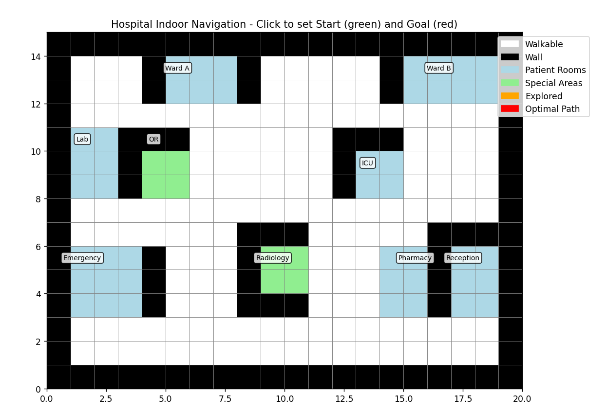
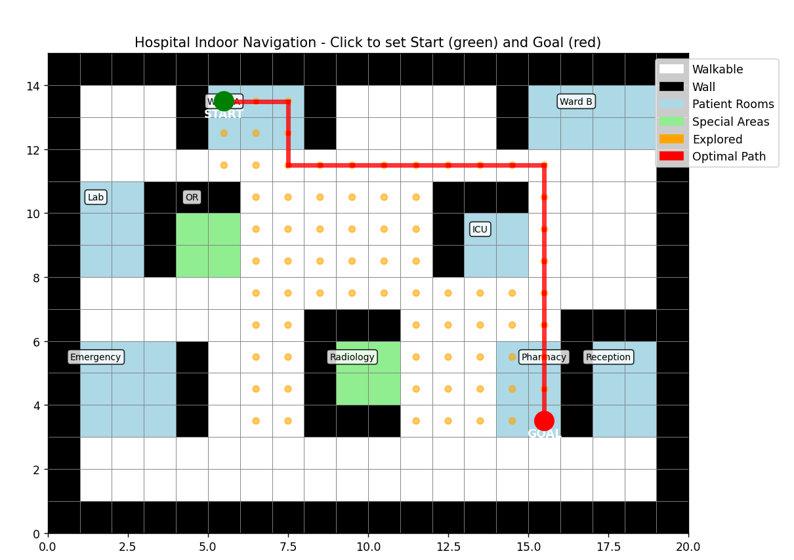

# astar-hospital
Interactive A* pathfinding visualization for hospital indoor navigation. Click to set start/goal points on a grid-based floor plan, compute optimal routes avoiding walls, and explore the algorithm's search in real-time using Matplotlib. Ideal for learning pathfinding in constrained environments like healthcare facilities.

[](https://www.python.org/downloads/)
[](https://opensource.org/licenses/MIT)

## 🎯 Features
- **Grid-Based Floor Plan**: 20x15 hospital layout with walls (black), walkable areas (white), patient rooms (light blue), and special areas like OR/ICU (light green).
- **Interactive UI**: Mouse-click to set START (green) and GOAL (red) points on valid tiles.
- **A* Pathfinding**: Computes optimal shortest paths using Manhattan heuristic, avoiding obstacles.
- **Real-Time Visualization**: 
  - Orange dots show explored nodes.
  - Red line traces the final path.
- **Controls**: Buttons for "Find Path", "Clear" (hide path), and "Reset" (clear all).
- **Room Labels**: Annotated key areas (e.g., Ward A, Emergency, Pharmacy) for context.

## 🛠️ Requirements
- Python 3.8+
- `matplotlib` (for plotting and widgets)
- `numpy` (for grid handling)

Install dependencies:
```bash
pip install matplotlib numpy
```

## 🚀 Quick Start
1. Clone or download the repository.
2. Save the main script as `tsp_astar.py`.
3. Run the application:
   ```bash
   python tsp_astar.py
   ```
4. Follow the on-screen instructions in the console and interact with the plot window.

## 📖 Usage
1. **Set Points**: Click on any walkable tile (white, blue, or green) to place the START point (first click). Click again for the GOAL point.
2. **Find Path**: Click the "Find Path" button to run A* and visualize the route.
3. **Explore**: Orange dots indicate nodes visited during search. The red line shows the optimal path.
4. **Controls**:
   - **Clear**: Remove the path (keep start/goal).
   - **Reset**: Clear everything and start over.
5. Console output logs coordinates, path length, and status.

### Example Interaction
- Start: Emergency Room (row 9, col 1)
- Goal: ICU (row 5, col 13)
- Expected: A path weaving through hallways, avoiding walls and rooms—typically 15-20 steps.

## 🔍 How It Works
The system uses **A*** (A-star) algorithm for efficient shortest-path finding:
- **Grid Representation**: A 2D NumPy array where `0` = walkable, `1` = wall, `2` = rooms, `3` = special areas.
- **Heuristic**: Manhattan distance (`|dx| + |dy|`) for admissibility.
- **Neighbors**: 4-directional (up/down/left/right) on valid tiles.
- **Search**: Priority queue (heapq) prioritizes lowest `f = g + h` score.
- **Visualization**: Matplotlib patches for tiles, circles for points, and lines for paths. Widgets handle button events.

For a deeper dive, check the `HospitalNavigator` class in `tsp_astar.py`.

## 📸 Screenshots
- Initial floor plan: 
- With path: 

## 📄 License
This project is licensed under the MIT License - see [LICENSE](LICENSE) for details.

## 🙏 Acknowledgments
- Inspired by classic A* demos and hospital layout challenges.
- Built with love using open-source tools: Matplotlib, NumPy.

---
